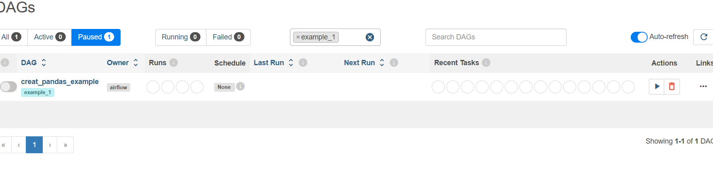
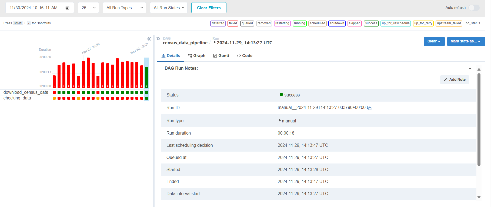
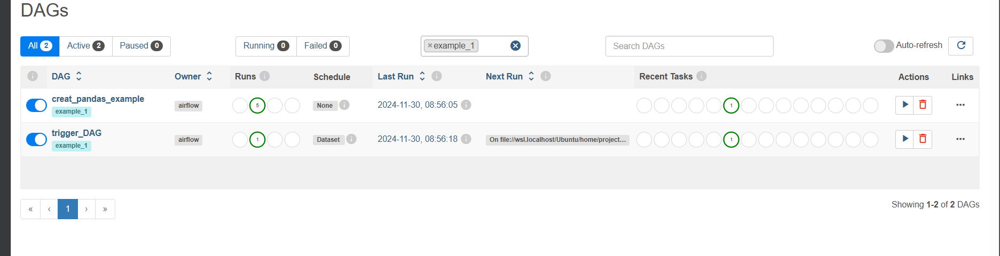
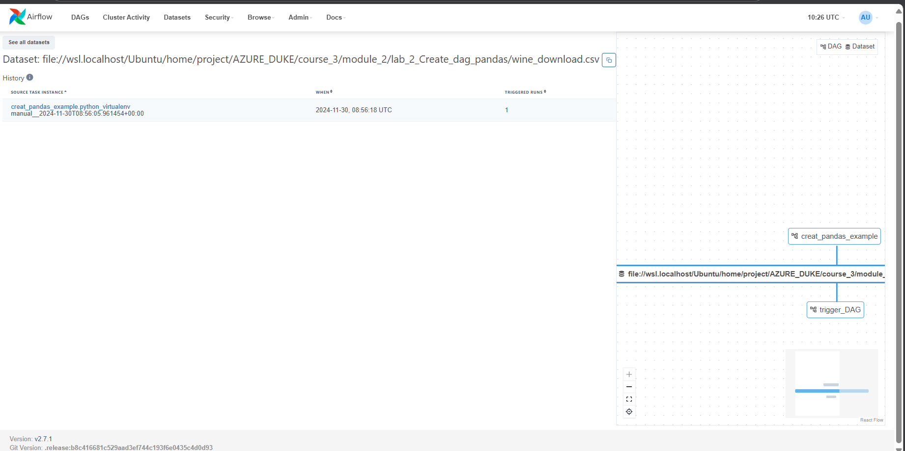

# General run
Besure to run it in Linux kernel

1. Ensure you check the virtualenv you have already installed in (evn)
2. please check /root/airflow/dags exits, if not, mkdir /root/airflow/dags
3. cp create_DAG.py /root/airflow/dags
4. check config file of /root/airflow/airflow.cfg 
   make sourse path of dag leads to /root/airflow/dags

5. RUN appication
 > Run port airflow webserver --port 8080
 > Run file create_DAG.py
 > Run: airflow scheduler (cais naỳ bắt buộc phải chạy, mỗi lần change code gì đó thì chạy lệnh này lại)

6. Check on localhost:8080
->> check output from log
->> kill port:
  ->> udo lsof -i :8080
  ->> sudo kill 'id_found"

## Lap 1: create_pipe_line.py

This Lap is for the purpose of create 2 python task in one flow.
  - Using PythonVirtualOperator is different from PythonOperator, when you try to assign python_env="{{ ti.xcom_pull(task_ids='pass_virtualenv_path') }}"  to the task: running_data_process_1 and running_data_process_2, you try to use the same Virtual env, that is not gona to work because the template.
  - when You try to define funtionc with decorator task and assign it to python_callable = some_funtion() that does not work.

  Please refer this link for more information: https://airflow.apache.org/docs/apache-airflow/stable/howto/operator/python.html

  @task_virtualenv
  def some_funtion():
 ......

 PythonVirtualenvOperator(
  ...
  python_callable = some_funtio,
  .....
 )

 ->> not work.

  - When you go to logs on airflow you can see that it create seperate virtual env for each task.

Result:

## Lap 2: create_DAG.py and trigger_DAG.py

This lab indicates how to automatically trigger one task based on schedule

  - create_DAG have virtual outlets, it is convenient from Airflow, which will let other DAGs know to excute when there is change of outlet.
  - trigger_DAG will be excuted automatically when there is a change in outlet, please define schedule in trigger_DAG.py

  

  - Goto the dataset to check file
  