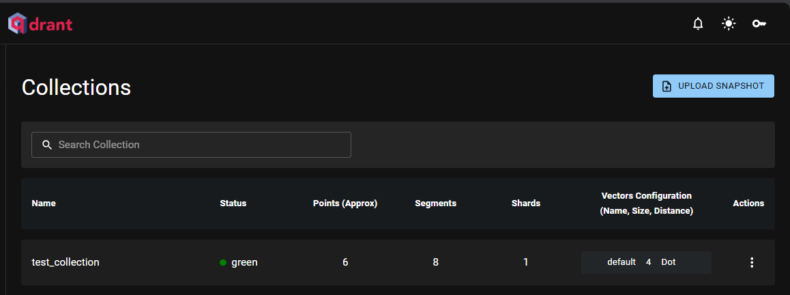
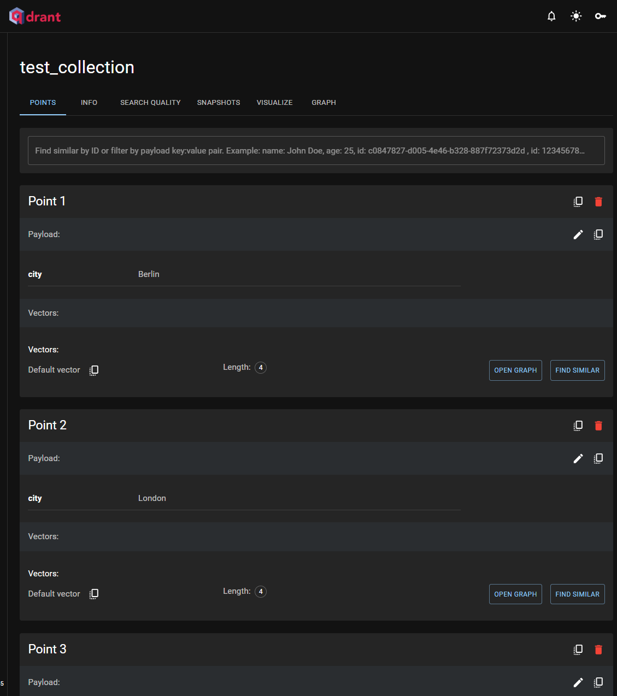

# RUN DOCKER and Qdrant 

## Purpose:
Using Docker and run file in Window.
Learn how to pull image, create collection, upsert vector and query for a small document.

## Run
Step 1: Install docker and open its application.

Step 2: download the latest Qdrant image from Dockerhub

    docker pull qdrant/qdrant

Step 3: Run docker service, please ensure the suitable format for path in Window

    docker run -p 6333:6333 -p 6334:6334 -v C:/Users/halib/OneDrive/Documents/project_code/DUKE/Course_3/module_3_lab_1/qdrant_storage:/qdrant/storage:z qdrant/qdrant

Alternative, run an exiting docker application, check id on app.
    docker start some_id

Step 4: open GUI in local host: localhost:6333/dashboard

Step 4: follow started_docker_qdrant.ipynb to add collection, vector

Step 5: run query to check vector
    python query.py

output: [ScoredPoint(id=4, version=0, score=1.362, payload=None, vector=None, shard_key=None, order_value=None), ScoredPoint(id=1, version=0, score=1.273, payload=None, vector=None, shard_key=None, order_value=None), ScoredPoint(id=3, version=0, score=1.208, payload=None, vector=None, shard_key=None, order_value=None)]