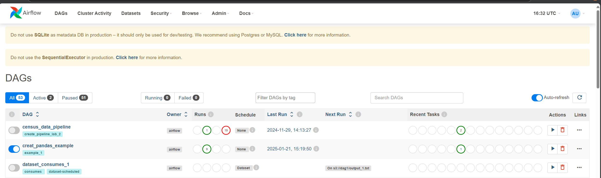
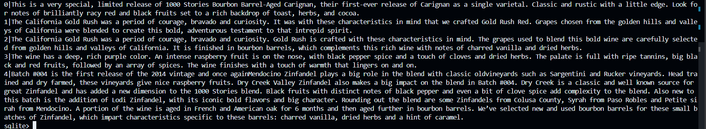

# Course 3 Advanced data engineering lap 4

## This lab contains:
Running on linux

Using apache airflow to trigger a task by scheduler.

Using sqlalchemy to create create_engine to store database because sqlalchemy can work with python syntax well.

Using sqlite3 to read tables from databas.

Main purpose: using apache airflow to automatic some procedure including download data and store it in local: create_DAG.py. Then by using scheduler, trigger_DAG_lab4.py to create a database and store table.
The task includes persisting data, that means you process data and store it in database for further use.

## Step
1. Activate python env, install apache-airflow
2. Run port then access local host 8080. Submit task create_DAG.py and trigger_DAG_lap4.py
```bash
    airflow webserver --port 8080
    create_DAG.py
    trigger_DAG_lap4.py
```
3. Trigger manually on web UI



4. Check database using Sqlite3:
```bash
    sqlite3 /workspaces/MySQL/wine_databse.db
    .tables
    select * from wine_notes;
```

