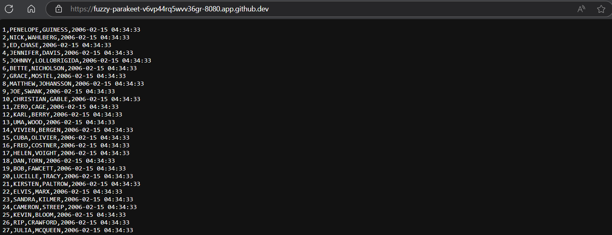

This is command line in Linux

# A. SETUP

1. Fisrt install mysql server client, Chỉ cài 1 lần duy nhất, nhớ start

        sudo apt update
        sudo apt install mysql-server mysql-client -y
        sudo service mysql start

2. Run mysql:  sudo mysql

Output: 

    @Lk13Antkoo ➜ /workspaces/MySQL (main) $ sudo mysql

    Welcome to the MySQL monitor.  Commands end with ; or \g.

    Your MySQL connection id is 12

    Server version: 8.0.40-0ubuntu0.20.04.1 (Ubuntu)
    
    Copyright (c) 2000, 2024, Oracle and/or its affiliates.
    
    Oracle is a registered trademark of Oracle Corporation and/or its
    
    affiliates. Other names may be trademarks of their respective
    
    owners.
    
    
    Type 'help;' or '\h' for help. Type '\c' to clear the current input statement.

3. Set password:

ALTER USER 'root'@'localhost' IDENTIFIED WITH mysql_native_password BY 'phamhoangan21';

FLUSH PRIVILEGES;

# B. LOGIN vào lại

1. sudo service mysql start
2. mysql -u root -p
3. Nhập mật khẩu
4. Create databse:

CREATE DATABASE budapest_demo;

5. Check database: 
show DATABASES
6. Up load sakita 3 file and run

        mysql> SOURCE /workspaces/MySQL/sakila-schema.sql;
      
        mysql> SOURCE /workspaces/MySQL/sakila-data.sql;

7. Sử dụng Sakila

USE sakila;

8. Show table: show full tables;

9. Because you are using github code space so you are restricted from some paths , check path can export file then modife path in next step

SHOW VARIABLES LIKE 'secure_file_priv';

10. Choose tables: select * from sakila.actor

        SELECT * FROM sakila.actor
        
        INTO OUTFILE '/var/lib/mysql-files/test_1_actor.csv'  
        
        FIELDS TERMINATED BY ','
        
        ENCLOSED BY '"'  
        
        LINES TERMINATED BY '\n';

11. Use a nother terminal, give access chmod 777 to /var/lib/mysql-files/test_1_actor.csv so that you can access that file.

12. create web.py and push infor into web

- Open bash -> vi web.py
- Inser codelines .... 

13. Open Bash -> type curl localhost:80801,PENELOPE,GUINESS,2006-02-15 04:34:33

output format: 
      ,PENELOPE,GUINESS,2006-02-15 04:34:33
      
      2,NICK,WAHLBERG,2006-02-15 04:34:33
      
      3,ED,CHASE,2006-02-15 04:34:33
      
      4,JENNIFER,DAVIS,2006-02-15 04:34:33

...

