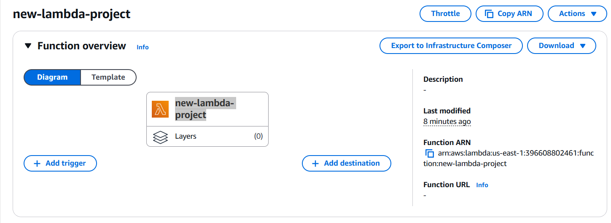

# Introduction

new-lambda-project is a Rust project that implements an AWS Lambda function in Rust.

## 1. Prerequisites

- [Rust](https://www.rust-lang.org/tools/install)
- [Cargo Lambda](https://www.cargo-lambda.info/guide/installation.html)

## 2. Building

To build the project for production, run `cargo lambda build --release`. Remove the `--release` flag to build for development.

Read more about building your lambda function in [the Cargo Lambda documentation](https://www.cargo-lambda.info/commands/build.html).

## 3. Testing

You can run regular Rust unit tests with `cargo test`.

If you want to run integration tests locally, you can use the `cargo lambda watch` and `cargo lambda invoke` commands to do it.

First, run `cargo lambda watch` to start a local server. When you make changes to the code, the server will automatically restart.
```bash
cargo lambda watch
```

Second, you'll need a way to pass the event data to the lambda function.

```bash
cargo lambda invoke --data-ascii '{"command": "this command has Marco"}' new-lambda-project
```


Explanation:

cargo lambda invoke: invokes your lambda function locally.

--data-ascii: provides JSON payload to the function.

function-name: the binary function name that you compiled with Cargo Lambda.

## 4.1 Deploying

4.1 Deploy the project

Run `make build`. This will create an IAM role and a Lambda function in your AWS account.
```bash
make build
```


4.2. Add function to lambda aws
```bash
make deploy
```
cargo lambda deploy --region us-east-1

✅ function deployed successfully 🎉

🛠️  binary last compiled 45 seconds ago

🔍 arn: 
arn:aws:lambda:us-east-1:396608802461:function:new-lambda-project

🎭 version: 1

4.3. Invoke remotely
```bash
make aws-invoke
```


4.4. Check lambda on aws:


4.5. Check lambda on Visual codecatalysis

Read more about deploying your lambda function in [the Cargo Lambda documentation](https://www.cargo-lambda.info/commands/deploy.html).

