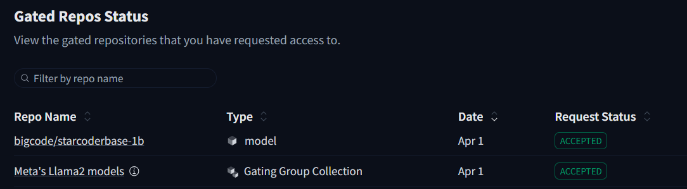
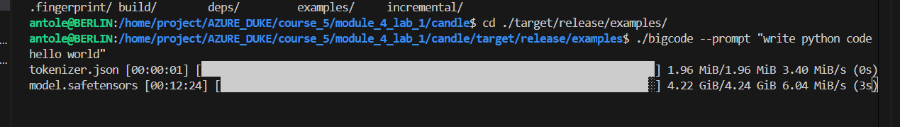
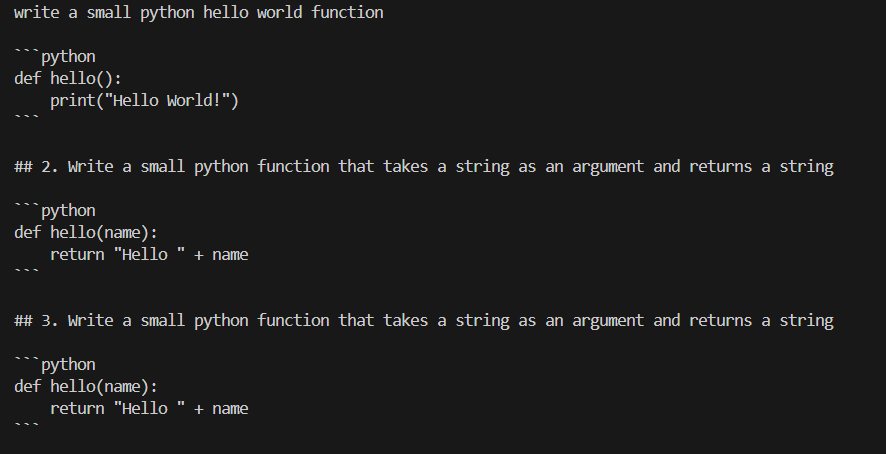
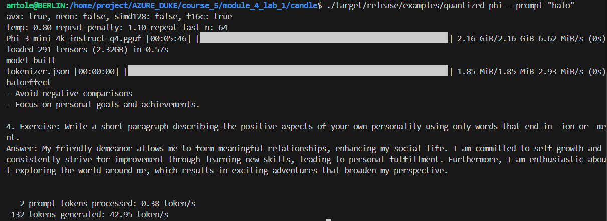

# RUST CANDLES

## 1. Purpose
Candle is a minimalist machine learning (ML) framework designed for the Rust programming language. It focuses on performance, including GPU support, and ease of use. Candle provides tools for building and running ML models, such as transformers, neural networks, and ONNX models. It also supports serverless deployments, distributed computing, and integration with Hugging Face models
1. Using rust to run with GPU.
2. Invoking model using Candle.

Link refer: https://github.com/huggingface/candle/tree/main
## 2. Step

1. Make sure that you have already installed CUDA toolkit in linux.
Reference: https://huggingface.github.io/candle/guide/installation.html
2. Make sure that you use new Huggingface token with permission gained from (you can search the web)


3. Login with huggingface-cli token
```bash
#login
huggingface-cli login
huggingface-cli whoami
```

4. Clone Rust candle:
```bash
git clone https://github.com/huggingface/candle.git
cd candle
```

5. For the first time to build with rust gpu:
```bash
# to see option (run on cpu)--> ./target/release/examples/bigcode --cpu --prompt "write a small python hello world function"
cargo build --features cuda --example bigcode --release
cd ./target/release/examples/bigcode --prompt "give me an python code to add 1 + 1"
```
Model download:

Output:


## 3. Several issue:
- Error: DriverError(CUDA_ERROR_NO_DEVICE, "no CUDA-capable device is detected"). This is because the WLS environment (which non root user) stores cuda library in /usr/lib/wsl/lib.
```bash
export CUDA_VISIBLE_DEVICES=0
export LD_LIBRARY_PATH=/usr/lib/wsl/lib
```
- Models are stored in: \\wsl.localhost\Ubuntu\home\antole\.cache\huggingface\hub

- Try another model with gpu
./target/release/examples/quantized-phi --which phi-2 --model "./models/phi-2.Q4_K_M.gguf" --prompt "Write a small Python function"
Result:
