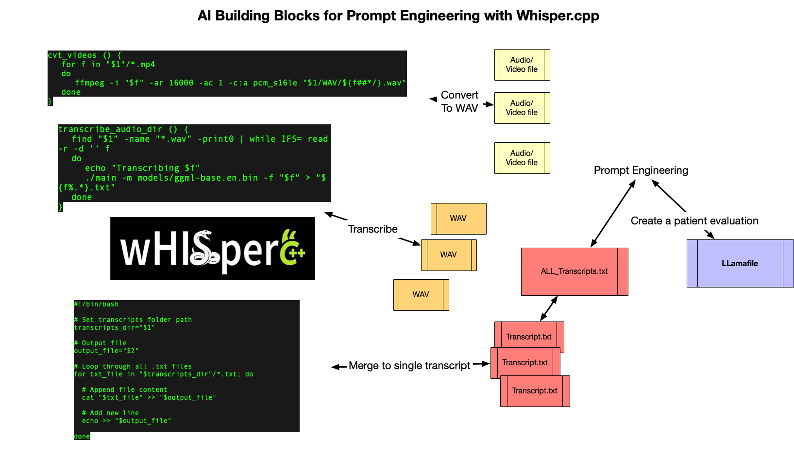
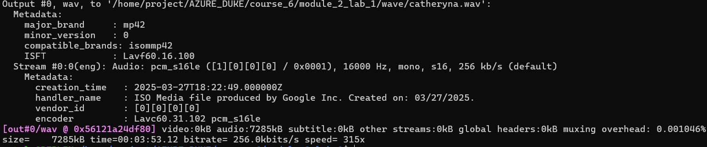

# This lab is about using Whisper.cpp

The purpose of this lab is:
 - Run local LLM with Whisper.cpp
 - Write Bash script to automate the procedure including: convert .mp4 file to .wav file  -> invoke Model to generate transcript --> convert from transcript format to .vtt file.

Install
'''bash
sudo apt-get install ffmpeg
'''
## 1. Investigate the process


## 2. Step

1. Make sure you have create the folder wave and video_folder with the structure below:

2. Convert .mp4 to .wav
Install ffmpeg
```bash
sudo apt-get install ffmpeg
```
Run script
```bash
covert_wav.sh video_name
```
Result:


3. Make sure to install Whisper.cpp (with CUDA) and download model.

Link refer: https://github.com/ggerganov/whisper.cpp/tree/master
