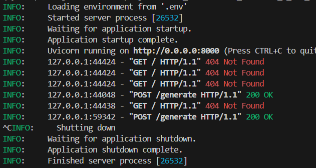
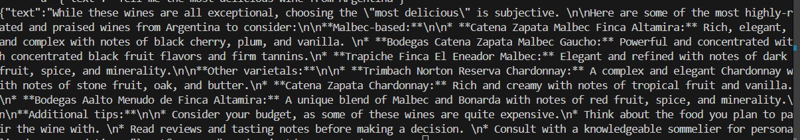

# Local LLM with RAG and FastAPI

## 1. Some notions:

The purposes of this lab are:
- Create a vector database bu using Qdrant.
- Using local LLM with llama.cpp.
- Using FastAPI to structure and use unvicorn to run a local web application.
- Using openai to mimic an API.

FastAPI is a framework, you can structure routes, handle HTTP, request...

Uvicorn is ASGI sever implementation to make FastAPI application work .

To query -> use uvicorn bash cli.

To seve vector database permanently, use docker.

## 2. References:

https://qdrant.tech/documentation/beginner-tutorials/search-beginners/

https://fastapi.tiangolo.com/#additional-optional-dependencies

https://huggingface.co/blog/train-sentence-transformers#:~:text=Sentence%20Transformers%20is%20a%20Python%20library%20for%20using,search%2C%20semantic%20textual%20similarity%2C%20paraphrase%20mining%2C%20and%20more.

## 3. Run
1. Setup
Install virtual env and packages in requirements.txt
2. Run FASTAPI applicatio
```bash
uvicorn --host 0.0.0.0 main_run:app --env-file .env
```
> Result

3. Run local model
```bash
./build/bin/llama-server -m ./gemma-1.1-7b-it.Q4_K_M.gguf -ngl 20
```
> Result
